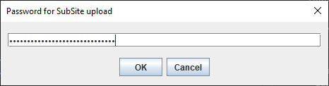

# SubSite upload tool

Utility to upload the contents of a local folder to a website via SFTP.

Arguments may be supplied via the command line (highest precedence), as environment variables, or as JSON Fields in `~/subsitecredentials.json` (lowest precedence).

## Requirements

Groovy must be installed.  

The first time the program is run the JSch library will be downloaded (into your local Maven repository `~/.m2`), for which an Internet connection is required.

A launcher is supplied for Windows. Linux, Unix and MacOS do not require a launcher.

## Installation

Put `subsite` and (for Windows) `subsite.bat` on your system PATH.

## Arguments

Command line argument | Environment variable | JSON Field | Notes
---|---|---|---
host=&lt;value&gt; | SUBSITE_HOST | host=&lt;value&gt; | SFTP host.
port=&lt;value&gt; | SUBSITE_PORT | port=&lt;value&gt; | JSON Field is a String. Default = 22.
user=&lt;value&gt; | SUBSITE_USER | user=&lt;value&gt; | SFTP username.
password=&lt;value&gt; | SUBSITE_PASSWORD | password= | Prompted for if unspecified / null.
source=&lt;value&gt; | SUBSITE_SOURCE | n/a | The local folder the contents of which will be uploaded.
target=&lt;value&gt; | SUBSITE_TARGET | n/a | The folder to create and populate on the server.

A Swing dialog will prompt for the password if it is not specified.



## Example usage

```
subsite host=myhost.net user=username source=build target=spaceinvaders
```

The utility will create any folders required on the target, and will overwrite files on the target with files from the source.  It does not delete or clear down the target folder.

## JSON Field Arguments

To supply values as JSON Fields (which may be overriddent with environment variables of command line arguments) create a file `subsitecredentials.json` in your home folder in the format:

```json
{
    "host": "",
    "port": "22",
    "user": "",
    "password": null
}
```

Then populate the `host`, `port` and `user` default values.

N.B. It is not recommended to populate the `password` value with a default.

## Files

`subsite` - Main source of Groovy application.
`subsite.bat` - Launcher for Windows.
`testupload.sh` - Simple test of application.
`README.md` - This documentation.
`screenshot.md` - Screenshot for README.
